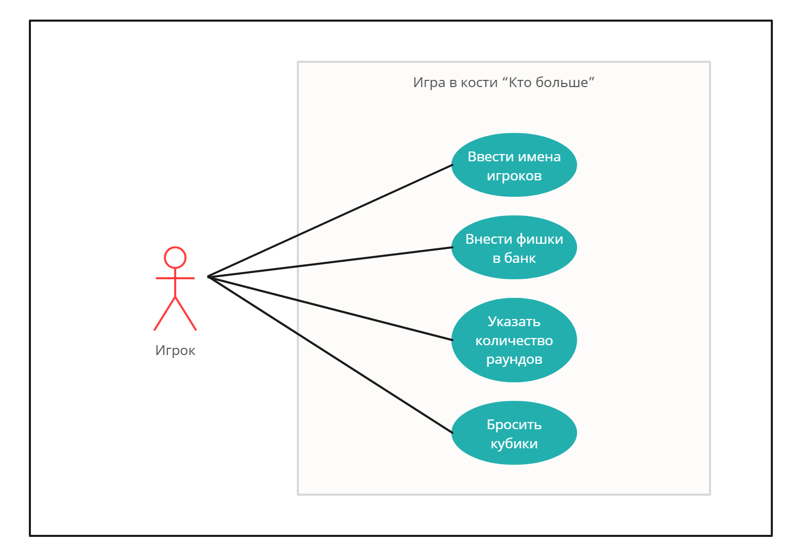

# Лабораторная работа №1

## Прецендент "Войти в игру"

| Прецедент | Войти в игру |
|---|---|
| Название | Войти в игру |
| Описание | Игрок вводит имя и количество фишек, которое хочет внести в банк |
| Основной исполнитель | Игрок |
| Предусловия | Имена игроков и количество фишек не введены |
| Постусловия | Данные игроков сохранены |

**Основной сценарий:**

| Действия актора | Реакция системы |
|---|---|
|1. Запустить игру||
||2. Запросить у игрока ввод его имени и количества фишек|
|3. Ввести имя и количество фишек||
||4. Сохранить данные игрока|

**Альтернативные сценарии:**

3а Игрок не вводит данные или вводит их некорректно

> 1\.  Система сообщает об ошибке ввода данных и просит ввести их корректно

 ## Прецендент "Ввести количество раундов"

| Прецедент | Ввести количество раундов |
|---|---|
| Название | Ввести количество раундов |
| Описание | Игрок вводит количество раундов для текущей игры |
| Основной исполнитель | Игрок |
| Предусловия | Игра не началась, не определено количество раундов |
| Постусловия | Определено количество раундов. Игра началась |

**Основной сценарий:**

| Действия актора | Реакция системы |
|---|---|
||1. Запросить кол-во раундов текущей игры|
|2. Ввести количество раундов||
||3. Сохранить введённые данные |
||4. Начать первый раунд |

**Альтернативные сценарии:**

2а Игрок не вводит данные или вводит их некорректно

> 1\. Система сообщает об ошибке ввода данных и просит ввести их корректно

## Прецендент "Бросить кости"

| Прецедент | Бросить кости |
|---|---|
| Название | Бросить кости |
| Описание | Игрок поочерёдно бросает три игральные кости, далее две оставшиеся и затем одну последнюю|
| Основной исполнитель | Игрок |
| Предусловия | Наступает очередь игрока кидать кости |
| Постусловия | Сумма очков игрока за текущий раунд сохраняется |

**Основной сценарий:**

| Действия актора | Реакция системы |
|---|---|
|1. Бросить три кости||
||2. Определить кость с наибольшим значением и сохранить в счёт игрока|
||3. Оставить на поле две кости|
|4. Бросить две игральные кости||
||5.  Определить кость с наибольшим значением и прибавить значение к счёту игрока|
||6. Оставить на поле одну кость|
|7. Бросить одну кость||
||8. Прибавить значение к счёту игрока игрока|
||9. Отобразить сумму очков игрока за его ход|

 ## Прецендент "Узнать очки "
 
| Прецедент | Узнать очки |
|---|---|
| Название | Узнать очки |
| Описание | Игрок смотрит свои очки за прошедший раунд|
| Основной исполнитель | Игрок |
| Предусловия | Все игроки завершили свой ход |
| Постусловия | Определён победитель текущего раунда |

**Основной сценарий:**

| Действия актора | Реакция системы |
|---|---|
|1. Узнать результаты раунда||
||2. Отобразить таблицу с результатами|
||3. Определить победителя раунда с наибольшим количеством очков |
||4. Добавить победителю раунда одно очко в общем зачёте игры |

**Альтернативные сценарии:**

3а Некоторые игроки набрали одинаковое наибольшее количество очков за раунд

> 1\. Дать игрокам с наибольшим количеством очков дополнительные броски
