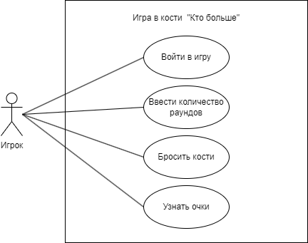

# Лабораторная работа №1

## Прецендент "Войти в игру"

| Прецедент | Войти в игру |
|---|---|
| Название | Войти в игру |
| Описание | Игрок вводит имя и количество фишек, которое хочет внести в банк |
| Основной исполнитель | Игрок |
| Предусловия | Имена игроков и количество фишек не введены |
| Постусловия | Данные игроков сохранены |

**Основной сценарий:**

| Действия актора | Реакция системы |
|---|---|
|1. Запустить игру||
||2. Запросить у игрока ввод его имени и количества фишек|
|3. Ввести имя и количество фишек||
||4. Сохранить данные игрока|

**Альтернативные сценарии:**

3а Игрок не вводит данные или вводит их некорректно

> 1\.  Система сообщает об ошибке ввода данных и просит ввести их корректно

 ## Прецендент "Ввести количество раундов"

| Прецедент | Ввести количество раундов |
|---|---|
| Название | Ввести количество раундов |
| Описание | Игрок вводит количество раундов для текущей игры |
| Основной исполнитель | Игрок |
| Предусловия | Игра не началась, не определено количество раундов |
| Постусловия | Определено количество раундов. Игра началась |

**Основной сценарий:**

| Действия актора | Реакция системы |
|---|---|
|1. Игрок вводит количество раундов||
||2. Сохранить введённые данные для определения количества раундов текущей игры|

**Альтернативные сценарии:**

1а Игрок не вводит данные или вводит их некорректно

> 1\. Система сообщает об ошибке ввода данных и просит ввести их корректно

| Прецедент | Бросить кости |
|---|---|
| Название | Бросить кости |
| Описание | Игрок поочередно бросает 3 игральные кости, |
| Основной исполнитель | Игрок |
| Предусловия | Игра не началась, не определено количество раундов |
| Постусловия | Определено количество раундов. Игра началась |

