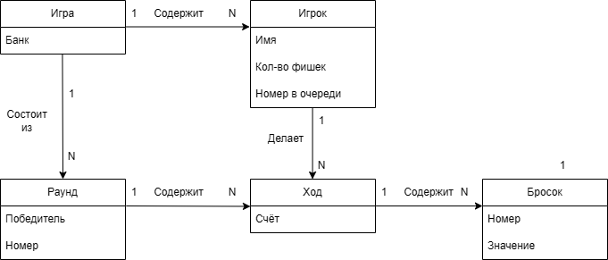

# Лабораторная работа №2

Модель предметной области

## Связи:
> ИГРА(победитель, банк) содержит несколько игровых РАУНДОВ(номер)
> 
> ИГРА(победитель, банк) содержит несколько ИГРОКОВ(имя, количество фишек, номер в очереди)
> 
> ИГРОК(имя, количество фишек, номер в очереди) делает за игру несколько ХОДОВ
> 
> ХОД содержит несколько БРОСКОВ(номер)
> 
> БРОСОК содержит несколько КОСТЕЙ(значение)
