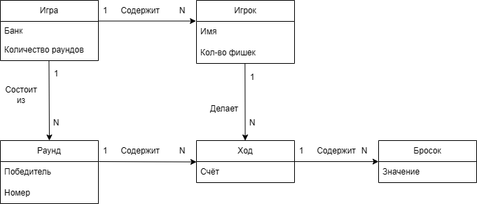

# Лабораторная работа №2

Модель предметной области

## Связи:
> ИГРА(банк) состоит из нескольких игровых РАУНДОВ(номер, победитель)
> 
> ИГРА(банк) содержит несколько ИГРОКОВ(имя, количество фишек, номер в очереди)
> 
> РАУНД(номер, победитель) содержит несколько ХОДОВ(счёт)
> 
> ИГРОК(имя, количество фишек, номер в очереди) делает за игру несколько ХОДОВ(счёт)
> 
> ХОД(счёт) содержит несколько БРОСКОВ(номер)
> 
> БРОСОК содержит несколько КОСТЕЙ(значение)
