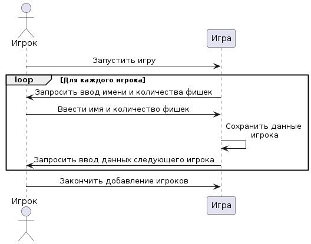
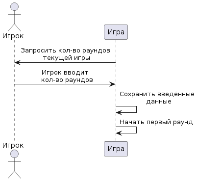
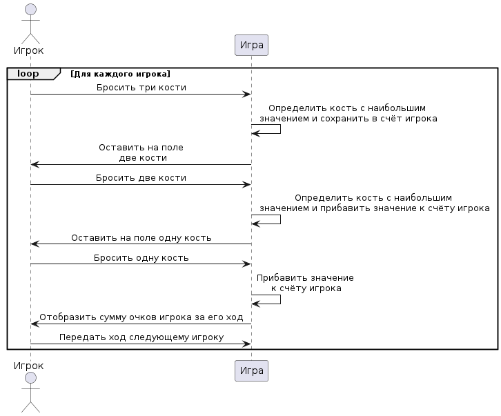
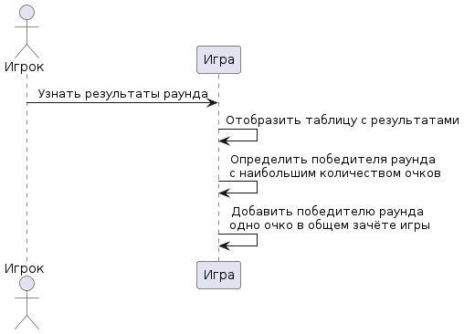

# Лабораторная работа №3 Системные диаграммы последовательностей

## Войти в игру

1. Запустить игру

| Действие | Запустить игру|
|---|---|
| Ссылки | Прецедент: Войти в игру |
| Предусловие | Игра не запущена |
| Постусловие | Игра запущена |

2. Запросить ввод имени и количества фишек

| Действие | Запросить ввод имени и количества фишек |
|---|---|
| Ссылки | Прецедент: Войти в игру |
| Предусловия | Игра запущена |
| Постусловие | Выведена форма для заполнения данных |

3. Ввести имя и количество фишек

| Действие | Ввести имя и количество фишек |
|---|---|
| Ссылки  Прецедент: Войти в игру |
| Предусловия | Выведена форма для заполнения данных |
| Постусловие | Данные игрока введены |

4. Сохранить данные игрока

| Действие | Сохранить данные игрока |
|---|---|
| Ссылки  Прецедент: Войти в игру |
| Предусловия | Игрок ввёл свои данные |
| Постусловие | Данные игрока сохранены в системе |

5. Запросить ввод данных следующего игрока

| Действие | Запросить ввод данных следующего игрока |
|---|---|
| Ссылки  Прецедент: Войти в игру |
| Предусловия | Данные предыдущего игрока сохранены в системе|
| Постусловие | Выведена форма для текущего игрока |

6. Закончить добавление игроков

| Действие | Закончить добавление игроков |
|---|---|
| Ссылки  Прецедент: Войти в игру |
| Предусловия | Все игроки ввели своё имя и кол-во фишек|
| Постусловие | Переход к прецеденту "Ввести количество раундов" |

## Ввести количество раундов

1. Запросить кол-во раундов для текущей игры

| Действие | Запросить кол-во раундов для текущей игры |
|---|---|
| Ссылки | Прецедент: Ввести количество раундов |
| Предусловие | Все игроки зарегестрировались в игре |
| Постусловие |Выведена форма для ввода кол-раундов |

2. Ввести количество раундов

| Действие | Ввести количество раундов |
|---|---|
| Ссылки | Прецедент: Ввести количество раундов |
| Предусловие | Выведена форма для заполнения |
| Постусловие | Введено количество раундов |

3. Сохранить введённые данные

| Действие | Сохранить введённые данные |
|---|---|
| Ссылки | Прецедент: Ввести количество раундов |
| Предусловие | Игрок ввёл кол-во раундов |
| Постусловие | Кол-во раундов для текущий игры сохранено в системе |

4. Начать первый раунд

| Действие | Начать первый раунд |
|---|---|
| Ссылки | Прецедент: Ввести количество раундов |
| Предусловие | Определено кол-во раундов игры |
| Постусловие | Игра началась |

## Бросить кости

1. Бросить три кости

| Действие | Бросить три кости |
|---|---|
| Ссылки | Прецедент: Бросить кости |
| Предусловие | На поле лежит три кости |
| Постусловие | Игрок бросил три кости |

2. Определить кость с наибольшим значением и сохранить в счёт игрока

| Действие | Определить кость с наибольшим значением и сохранить в счёт игрока |
|---|---|
| Ссылки | Прецедент: Бросить кости |
| Предусловие | Игрок бросил кости |
| Постусловие | Кость с наибольшим значением определена и сохранена в счёт игрока |

3. Оставить на поле две кости

| Действие |  Оставить на поле две кости|
|---|---|
| Ссылки | Прецедент: Бросить кости |
| Предусловие | Предыдущее наибольшее значение сохранено |
| Постусловие | На поле остаётся две кости |

4. Бросить две кости

| Действие |  Бросить две кости|
|---|---|
| Ссылки | Прецедент: Бросить кости |
| Предусловие | На поле лежит две кости |
| Постусловие | Игрок бросил две кости |

5. Определить кость с наибольшим значением и прибавить значение к счёту игрока

| Действие | Определить кость с наибольшим значением и прибавить значение к счёту игрока |
|---|---|
| Ссылки | Прецедент: Бросить кости |
| Предусловие |  Игрок бросил кости |
| Постусловие | Кость с наибольшим значением определена и добавлена в счёт игрока |

6. Оставить на поле одну кость

| Действие | Оставить на поле одну кость |
|---|---|
| Ссылки | Прецедент: Бросить кости |
| Предусловие | Предыдущее наибольшее значение добавлено к счёту игрока |
| Постусловие | На поле остаётся одна кость |

7. Бросить одну кость

| Действие | Бросить одну кость |
|---|---|
| Ссылки | Прецедент: Бросить кости |
| Предусловие | На поле лежит одна кость |
| Постусловие | Игрок бросил последнюю кость |

8. Прибавить значение к счёту игрока

| Действие | Прибавить значение к счёту игрока |
|---|---|
| Ссылки | Прецедент: Бросить кости |
| Предусловие | Игрок бросил последнюю кость|
| Постусловие | Значение кости прибавлено к счёту игрока |

9. Отобразить сумму очков игрока за его ход

| Действие | Отобразить сумму очков игрока за его ход |
|---|---|
| Ссылки | Прецедент: Бросить кости |
| Предусловие | Игрок сделал последний бросок|
| Постусловие | Выведена сумма очков игрок за текущий ход |

10. Передать ход следующему игроку

| Действие | Передать ход следующему игроку |
|---|---|
| Ссылки | Прецедент: Бросить кости |
| Предусловие | Игрок закончил свой ход|
| Постусловие | Ход передан следующему игроку |

## Узнать очки

1. Узнать результаты раунда

| Действие | Узнать результаты раунда |
|---|---|
| Ссылки | Прецедент: Узнать очки |
| Предусловие | Раунд завершён|
| Постусловие | Формирование таблицы результатов |

2. Отобразить таблицу с результатами

| Действие | Отобразить таблицу с результатами |
|---|---|
| Ссылки | Прецедент: Узнать очки |
| Предусловие | Таблица результатов сформирована|
| Постусловие | Выведена таблица результатов за раунд |

3. Определить победителя раунда с наибольшим количеством очков

| Действие | Определить победителя раунда с наибольшим количеством очков |
|---|---|
| Ссылки | Прецедент: Узнать очки |
| Предусловие | Закончен раунд, подсчитаны результаты|
| Постусловие | Определён победитель раунда |

4. Добавить победителю раунда одно очко в общем зачёте игры

| Действие | Добавить победителю раунда одно очко в общем зачёте игры|
|---|---|
| Ссылки | Прецедент: Узнать очки |
| Предусловие | Определён победитель раунда |
| Постусловие | Победителю добавлено одно очко в общем зачёте |

