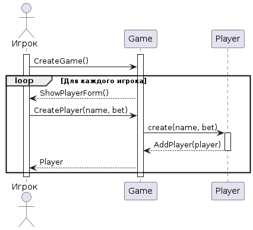
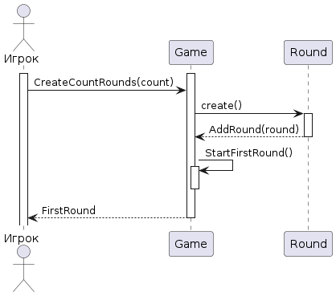
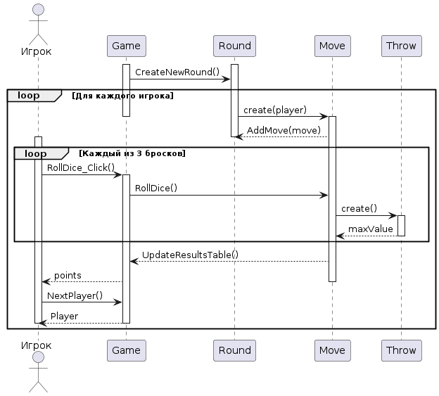

# Лабораторная работа №4 Системные диаграммы взаимодействий

## Войти в игру

| Операция | CreateNewGame() |
|---|---|
| Ссылки | Прецедент "Войти в игру" |
| Предусловия | Игрок нажал кнопку "Начать игру" |
| Постусловия | Игра запущена, создан экземпляр game класса Game |

| Операция | ShowPlayerForm() |
|---|---|
| Ссылки | Прецедент "Войти в игру" |
| Предусловия | Запущена новая игра |
| Постусловия | Выведена форма для ввода данных игрока |

| Операция | CreatPlayer(name, count_chips) |
|---|---|
| Ссылки | Прецеденты "Войти в игру" |
| Предусловия | Выведена форма для ввода данных игрока |
| Постусловия | Создан экземпляр player класса Player. Атрибуту player.name присвоено значение name, атрибуту player.count_chips присвоено значениеcount_chips |

| Операция | AddPlayer(player) |
|---|---|
| Ссылки | Прецеденты "Войти в игру" |
| Предусловия | Создан экземпляр player класса Player  |
| Постусловия | Экземпляр player класса Player добавлен в атрибут класса Game |

## Ввести количество раундов

| Операция | CreatRoundsGame(count)|
|---|---|
| Ссылки | Прецедент "Ввести количество раундов" |
| Предусловия | Игрок ввел количество раундов для текущей игры |
| Постусловия | Создан экземпляр round класса Round. Атрибуту round.count присвоено значение count|

| Операция | AddRound(round) |
|---|---|
| Ссылки | Прецеденты "Ввести количество раундов" |
| Предусловия | Создан экземпляр round класса Round. Атрибуту round.count присвоено значение count |
| Постусловия |  Экземпляр round класса Round добавлен в атрибут класса Game |

| Операция | StartFirstRound() |
|---|---|
| Ссылки | Прецеденты "Ввести количество раундов" |
| Предусловия | Экземпляр round класса Round добавлен в атрибут класса Game |
| Постусловия | Начался первый раунд текущей игры |

## Бросить кости

| Операция | CreatNewRound()|
|---|---|
| Ссылки | Прецедент "Бросить кости" |
| Предусловия | Создан экземпляр round класса Round. |
| Постусловия | Экземпляр round класса Round добавлен в атрибут класса Game |

| Операция | AddMove(move) |
|---|---|
| Ссылки | Прецеденты "Бросить кости" |
| Предусловия | Создан экземпляр move класса Move. Атрибуту round.count присвоено значение count |
| Постусловия | Экземпляр move класса Move добавлен в атрибут класса Round |

| Операция | Roll Dice(dices) |
|---|---|
| Ссылки | Прецеденты "Бросить кости" |
| Предусловия | Экземпляр move класса Move добавлен в атрибут класса Round |
| Постусловия | Создан экземпляр throw класса Throw, ему случайное значений в диапазоне от 1 до 6|

| Операция | UpdateResultsTable |
|---|---|
| Ссылки | Прецеденты "Бросить кости" |
| Предусловия | Игрок завершил свой ход |
| Постусловия | Таблица результатов обновлена|

| Операция | NextPlayer() |
|---|---|
| Ссылки | Прецеденты "Бросить кости" |
| Предусловия | Игрок завершил свой ход, |
| Постусловия | Ход передаётся следующему по списку игроку|

## Узнать очки

| Операция | ShowResultsRound |
|---|---|
| Ссылки | Прецедент "Узнать очки" |
| Предусловия | Игроки завершили свои ходы в текущем раунде |
| Постусловия | Подведены итоги раунда |

| Операция | DetermineWinner() |
|---|---|
| Ссылки | Прецеденты "Узнать очки" |
| Предусловия | Подведены итоги раунда |
| Постусловия | Определён победитель раунда |

| Операция | DisplayResultsRound() |
|---|---|
| Ссылки | Прецеденты "Узнать очки" |
| Предусловия | Определён победитель раунда |
| Постусловия | Выведена таблица результатов раунда и победитель в нём|

| Операция | AddPointWinner() |
|---|---|
| Ссылки | Прецеденты "Узнать очки" |
| Предусловия | Определён победитель раунда|
| Постусловия | Игроку-победителю добавлено одно очко в общем зачёте игры|
